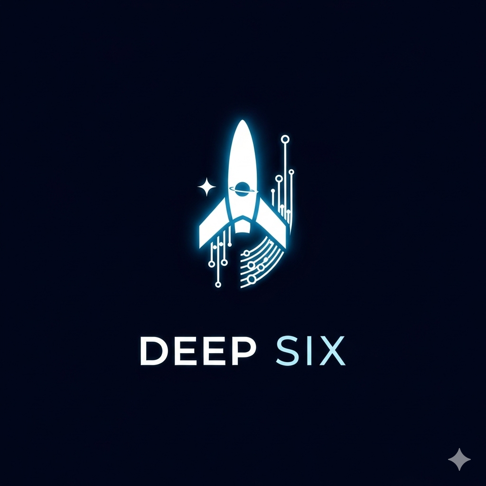

# DeepSix - Navigate the Deepest Frontiers

<div align="center">
  

  <p align="center">
    <strong>Real-time mission control for humanity's journey into the deepest reaches of space</strong>
  </p>

  <!-- Badges -->
  <p align="center">
    <a href="https://github.com/Sarks0/DeepSix/stargazers">
      
    </a>
    <a href="https://github.com/Sarks0/DeepSix/blob/main/LICENSE">
      
    </a>
    <a href="https://github.com/Sarks0/DeepSix/commits/main">
      
    </a>
    <a href="https://github.com/Sarks0/DeepSix/graphs/contributors">
      
    </a>
  </p>

  <!-- Tech Stack Badges -->
  <p align="center">
    
    
    
    
    
  </p>

  <p align="center">
    <a href="https://deepsix.vercel.app">Live Demo</a>
    ·
    <a href="#features">Features</a>
    ·
    <a href="#getting-started">Getting Started</a>
    ·
    <a href="#mission-coverage">Missions</a>
    ·
    <a href="#contributing">Contributing</a>
  </p>
</div>

---

## About

A comprehensive real-time dashboard for tracking **15+ NASA deep space missions** across the solar system and beyond. DeepSix provides live mission data, spacecraft telemetry, Mars sol cycle monitoring, and real-time position tracking using NASA's official APIs.

> **Note:** This is an active hobby project with continuous improvements and new features being added regularly. More data sources and mission coverage coming soon!

---

## Features

### Mars Mission Tracking
- **Real-time Sol Tracking** - Live Martian day counters for Perseverance & Curiosity
- **Mars Local Solar Time (MLST)** - Accurate timekeeping on Mars
- **Seasonal Information** - Current Mars season and solar longitude
- **Latest Surface Photos** - Fresh images from Mars rovers with automatic rotation
- **Mission Telemetry** - Health status, signal strength, and data rates

### Deep Space Missions
- **Live Position Data** - Real-time spacecraft positions via JPL Horizons API
- **Distance & Velocity** - Current distance from Earth and travel speeds
- **Communication Delays** - Signal travel time calculations (one-way & round-trip)
- **Mission Status** - Health, operational status, and fuel remaining
- **Journey Progress** - For en route missions (Europa Clipper, Lucy, Psyche, OSIRIS-APEX)

### Mission Coverage (15+ Missions)
- **Mars System** - 5 active missions (rovers, orbiters, landers)
- **Deep Space Probes** - Voyager 1 & 2, Parker Solar Probe, New Horizons
- **Jupiter System** - Juno orbiter, Europa Clipper (en route)
- **Asteroid Missions** - Lucy, Psyche, OSIRIS-APEX (all en route)
- **Space Observatories** - James Webb Space Telescope

### User Experience
- **Full-Width Responsive Design** - Optimized for all screen sizes
- **Data Source Attribution** - Clear labeling of API sources (NASA, JPL)
- **Smooth Animations** - Powered by Framer Motion
- **Offline Support** - Image caching with IndexedDB
- **Real-time Updates** - Live data feeds with configurable refresh rates

---

## Mission Coverage

### Mars System (5 missions)
| Mission | Type | Status | Tracking |
|---------|------|--------|----------|
| **Perseverance** | Rover | Active | Sol tracking, Photos, Telemetry |
| **Curiosity** | Rover | Active | Sol tracking, Photos, Telemetry |
| **Mars Reconnaissance Orbiter** | Orbiter | Active (19+ years) | Status, Telemetry |
| **MAVEN** | Orbiter | Active | Status, Telemetry |
| **Mars Odyssey** | Orbiter | Active (24+ years) | Status, Telemetry |

### Deep Space Probes (4 missions)
| Mission | Location | Distance | Tracking |
|---------|----------|----------|----------|
| **Voyager 1** | Interstellar Space | 164+ AU | Position, Status, Telemetry |
| **Voyager 2** | Interstellar Space | 134+ AU | Position, Status, Telemetry |
| **Parker Solar Probe** | Solar Corona | Variable | Position, Status, Telemetry |
| **New Horizons** | Kuiper Belt | 62.2 AU | Position, Status, Telemetry |

### Jupiter System (2 missions)
| Mission | Status | Arrival | Tracking |
|---------|--------|---------|----------|
| **Juno** | Active (Extended) | In orbit | Position, Status, Telemetry |
| **Europa Clipper** | En Route | April 2030 | Position, Journey Status |

### Asteroid Missions (3 missions)
| Mission | Target | Arrival | Tracking |
|---------|--------|---------|----------|
| **Lucy** | Trojan Asteroids | 2027-2033 | Position, Journey Status |
| **Psyche** | Metallic Asteroid | August 2029 | Position, Journey Status |
| **OSIRIS-APEX** | Asteroid Apophis | April 2029 | Position, Journey Status |

### Space Observatories (1 mission)
| Mission | Location | Purpose | Tracking |
|---------|----------|---------|----------|
| **James Webb** | L2 Lagrange | Infrared Observatory | Status, Telemetry |

### Historical Missions (Available)
- **Mars InSight** - Ended December 2022 (Seismic studies)

---

## Getting Started

### Prerequisites

- **Node.js 20+** - [Download](https://nodejs.org/)
- **NASA API Key** - Free at [api.nasa.gov](https://api.nasa.gov)

### Installation

1. **Clone the repository**
   ```bash
   git clone https://github.com/Sarks0/DeepSix.git
   cd DeepSix
   ```

2. **Install dependencies**
   ```bash
   npm install
   ```

3. **Set up environment variables**
   ```bash
   cp .env.example .env.local
   # Edit .env.local and add your NASA API key
   ```

4. **Run the development server**
   ```bash
   npm run dev
   ```

5. **Open the dashboard**

   Navigate to [http://localhost:3000](http://localhost:3000)

### Deployment

**Deploy to Vercel** (Recommended):

[](https://vercel.com/new/clone?repository-url=https://github.com/Sarks0/DeepSix)

**Or build manually**:
```bash
npm run build
npm run start
```

---

## Tech Stack

### Core Framework
- **Next.js 15** - React framework with App Router and Server Components
- **TypeScript** - Full type safety and enhanced developer experience
- **React 19** - Latest React features and performance improvements

### Styling & UI
- **Tailwind CSS** - Utility-first CSS framework
- **Framer Motion** - Production-ready animation library
- **CSS Grid & Flexbox** - Modern responsive layouts

### State Management & Data
- **Zustand** - Lightweight state management
- **IndexedDB** - Client-side data caching for offline support
- **React Query** - Server state management (coming soon)

### APIs & Data Sources
- **NASA Mars Rover Photos API** - Latest images from Mars surface
- **NASA JPL Horizons API** - Real-time spacecraft positions
- **NASA Deep Space Network (DSN)** - Communication tracking
- **Mars Weather API** - Martian atmospheric data

### Development Tools
- **ESLint** - Code linting and style enforcement
- **Prettier** - Code formatting
- **TypeScript Compiler** - Type checking

### Deployment
- **Vercel** - Edge network deployment with automatic CI/CD
- **GitHub Actions** - Automated testing and deployment workflows

---

## Development Commands

| Command | Description |
|---------|-------------|
| `npm run dev` | Start development server (localhost:3000) |
| `npm run build` | Build for production |
| `npm run start` | Start production server |
| `npm run lint` | Run ESLint code linting |
| `npm run type-check` | TypeScript type checking |
| `npm run format` | Format code with Prettier |

---

## Roadmap

### Current Features
- [x] 15+ mission coverage with live data
- [x] Real-time position tracking (JPL Horizons API)
- [x] Mars sol tracking for active rovers
- [x] Mission status indicators and telemetry
- [x] Communication delay calculations
- [x] Full-width responsive design
- [x] Data source attribution

### Planned Features
- [ ] Mission filtering and sorting
- [ ] 3D visualization of spacecraft positions
- [ ] Historical mission archives
- [ ] International missions (ESA, JAXA)
- [ ] Timeline view for mission milestones
- [ ] Deep Space Network (DSN) status dashboard
- [ ] Mission comparison tools
- [ ] Export mission data (CSV, JSON)
- [ ] Dark/Light theme toggle
- [ ] Notification system for mission events

---

## Contributing

Contributions are welcome! Whether it's:

- Bug reports
- Feature suggestions
- Documentation improvements
- UI/UX enhancements
- Code contributions

**How to contribute:**

1. Fork the repository
2. Create a feature branch (`git checkout -b feature/AmazingFeature`)
3. Commit your changes (`git commit -m 'Add some AmazingFeature'`)
4. Push to the branch (`git push origin feature/AmazingFeature`)
5. Open a Pull Request

---

## License

This project is licensed under the **Apache License 2.0** - see the [LICENSE](LICENSE) file for details.

---

## Acknowledgments

- **NASA** - For providing incredible public APIs and mission data
- **JPL** - For the Horizons System API and spacecraft tracking data
- **Vercel** - For seamless deployment and hosting
- **Open Source Community** - For the amazing tools and libraries that make this possible

---

## Contact

**Project Maintainer:** [@Sarks0](https://github.com/Sarks0)

**Project Link:** [https://github.com/Sarks0/DeepSix](https://github.com/Sarks0/DeepSix)

**Live Demo:** [https://deepsix.vercel.app](https://deepsix.vercel.app)

---

<div align="center">
  <p><strong>Built with passion for space exploration</strong></p>
  <p><em>Bringing the cosmos closer to everyone, one mission at a time</em></p>

  <sub>Star this repo if you find it interesting!</sub>
</div>
